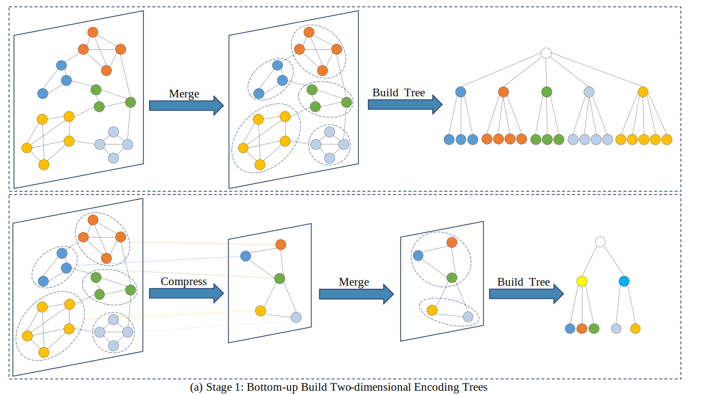
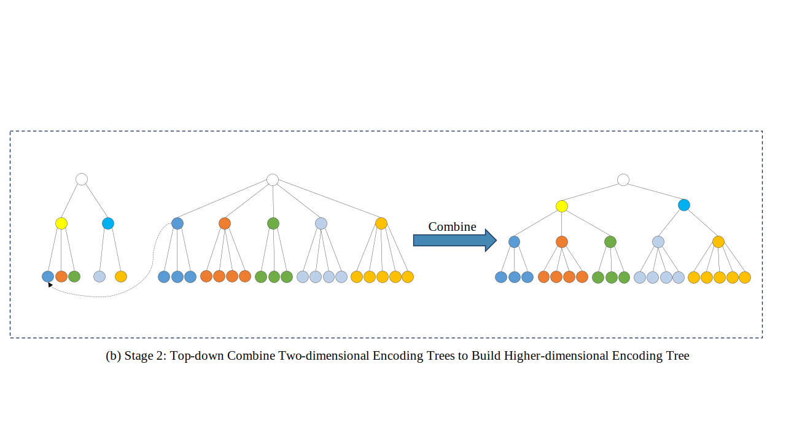

# Structural Entropy Guided Meta Learning for Few-shot Node Classification

  
Figure 1: An illustration of our motivation about the minimal and sufficient meta-knowledge *Z* in Proposition 1. When *Z* contains information about the graph structure *G* and base class *Yb* that is unrelated to the novel class *Yn*, it could result in overfitting.

#######################################################################################################  

  
Figure 2: Bottom-up construction of the two-dimensional encoding trees. 
#####
  
Figure 3: Top-down construction of the higher-dimensional encoding tree.  

#######################################################################################################
