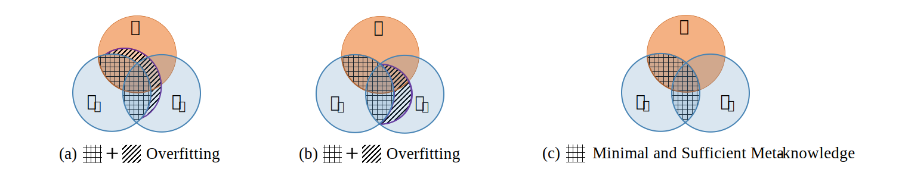

# Structural Entropy Guided Meta Learning for Few-shot Node Classification

  
Figure 1: An illustration of our motivation about the minimal and sufficient meta-knowledge *Z* in Proposition 1. When *Z* contains information about the graph structure *G* and base class *Yb* that is unrelated to the novel class *Yn*, it could result in overfitting.

#######################################################################################################

  
Figure 1: An illustration of our motivation about the minimal and sufficient meta-knowledge *Z* in Proposition 1. When *Z* contains information about the graph structure *G* and base class *Yb* that is unrelated to the novel class *Yn*, it could result in overfitting.

(a) Stage 1: Bottom-up Build Two-dimensional Encoding Trees

(b) Stage 2: Top-down Combine Two-dimensional Encoding Trees to Build Higher-dimensional Encoding Tree

